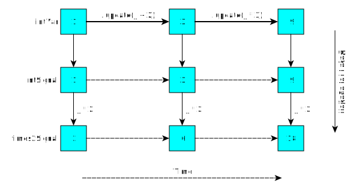

In this second tutorial, we learn how to develop UIs in Scala.js with [Laminar](https://laminar.dev/).

We start here with the project setup developed in the previous tutorial about [Setting up Scala.js with Vite](./scalajs-vite.html).
To follow along this tutorial, either use the result of the previous tutorial, or checkout [the scalajs-vite-end-state branch](https://github.com/sjrd/scalajs-sbt-vite-laminar-chartjs-example/tree/scalajs-vite-end-state) of the accompanying repo.

If you prefer to navigate the end result for this tutorial directly, checkout [the laminar-end-state branch](https://github.com/sjrd/scalajs-sbt-vite-laminar-chartjs-example/tree/laminar-end-state) instead.

[See the final result in action and fiddle with the code in Scribble](https://scribble.ninja/u/sjrd/ddueiaxghmbmbnbpzggmkwwmpigc)

## Prerequisites

Make sure to install [the prerequisites](./index.html#prerequisites) before continuing further.

## Introducing Laminar

[Laminar](https://laminar.dev/) is a Scala.js library to build UIs using Functional Reactive Programming (FRP).
FRP is a hybrid model between imperative and functional programming.
It is particularly well suited to developing UIs in Scala, as we can reason about relationships between immutable values while dealing with the changing nature of the UI.
We will elaborate on this point later.

To start off, we add a dependency on Laminar in our `build.sbt`:


     libraryDependencies += "org.scala-js" %%% "scalajs-dom" % "2.4.0",
+
+    // Depend on Laminar
+    libraryDependencies += "com.raquo" %%% "laminar" % "0.14.2",
   )


Once that is done, start the incremental compiler:


$ sbt
[...]
sbt:livechart> ~fastLinkJS
[...]


If sbt was already running, run `reload` for the changes in `build.sbt` to take effect, then start the incremental compiler with `~fastLinkJS`.

Additionally, start Vite's development server if it wasn't already running:


$ npm run dev
[...]


We can now change the contents of `src/main/scala/livechart/LiveChart.scala` to use Laminar instead of vanilla DOM APIs.

At the top, we use the following import:


import com.raquo.laminar.api.L.{*, given}


That import brings all the Laminar features we want into scope.

We replace the contents of the main `def LiveChart` method with a call to Laminar's `renderOnDomContentLoaded` method.
This method bootstraps Laminar by installing a Laminar `Element` in an existing DOM element:


@main
def LiveChart(): Unit =
  renderOnDomContentLoaded(
    dom.document.getElementById("app"),
    Main.appElement()
  )


and we then define `Main.appElement` as follows:


object Main:
  def appElement(): Element =
    div(
      a(href := "https://vitejs.dev", target := "_blank",
        img(src := "/vite.svg", className := "logo", alt := "Vite logo"),
      ),
      a(href := "https://developer.mozilla.org/en-US/docs/Web/JavaScript", target := "_blank",
        img(src := javascriptLogo, className := "logo vanilla", alt := "JavaScript logo"),
      ),
      h1("Hello Laminar!"),
      div(className := "card",
        button(tpe := "button"),
      ),
      p(className := "read-the-docs",
        "Click on the Vite logo to learn more",
      ),
    )
  end appElement
end Main


Instead of using HTML tags in a big string, we use Laminar functions corresponding to every kind of DOM element.
In the parameters, we can specify both attributes, using the `:=` operator, and child elements.

Every reference is type-checked.
If we misspell `button` as `buton`, or if we try to put an integer in `target := 0`, the compiler will flag it as an error.

### Code of the button

Now, we have not yet replicated the behavior of the button.
Previously the code using the DOM API was the following:


def setupCounter(element: dom.Element): Unit =
  var counter = 0

  def setCounter(count: Int): Unit =
    counter = count
    element.innerHTML = s"count is $counter"

  element.addEventListener("click", e => setCounter(counter + 1))
  setCounter(0)
end setupCounter


In Laminar, we do not use event listeners to directly mutate the attributes of DOM elements.
Instead, we use `Var`s and `Signal`s to model *time-varying* values.

Let us isolate the button definition in a separate method, and illustrate how to write its behavior using Laminar:


  def counterButton(): Element =
    val counter = Var(0)
    button(
      tpe := "button",
      "count is ",
      child.text <-- counter,
      onClick --> { event => counter.update(c => c + 1) },
    )
  end counterButton


We declare `counter` as a `Var[Int]` initialized with `0`.
We then use it in two *bindings*:

* In `child.text <-- counter`, we declare a text child of the button whose content will always reflect the value of `counter`.
  Together with the first (immutable) text child `"count is "`, it initially forms the text `"count is 0"`.
  As the value of `counter` changes over time, so does the text in the button.
* In `counter.update(c => c + 1)`, we schedule an update of the value of `counter`, to be increased by 1.
  We schedule that as a result of the `onClick -->` event of the button.

We do not need to explicitly set the `innerText` attribute of the button.
That is taken care of by the `<--` binding.

Unlike frameworks based on a virtual DOM, Laminar bindings directly target the DOM element to update.
With a virtual DOM, when the value of `counter` changes, we would build an entirely new VDOM representation for the button (and perhaps its parents), and the framework would later diff it and identify which DOM `HTMLButtonElement` to update.
In Laminar, however, the `<--` binding remembers the precise instance of `HTMLButtonElement` to update, and directly modifies its text.
This is more efficient than going through the VDOM indirection.

Beside `:=`, the two binding arrows `<--` and `-->` are the only symbolic operators that Laminar defines.
`:=` is a static binding.
It can be seen as a `<--` with a time-immutable value on the right.
The left arrow `<--` makes data flow from the right to the left; it is usually used with DOM attributes on the left and *signals* on the right.
The right arrow `-->` makes data flow from the left to the right; it is usually used with DOM *events* on the left and *observers* on the right.
It helps to visualize the UI as being "on the left" and the application data model as being "on the right".

## `Var`s, `Signal`s, and Functional Reactive Programming

Before going further, let us look more closely at what *are* `Var`s and `Signal`s.

Consider the following three definitions:


val intVar: Var[Int] = Var(1)
val intSignal: Signal[Int] = intVar.signal
val times2Signal: Signal[Int] = intSignal.map(_ * 2)


The first definition is a `Var` containing an `Int`, like the `counter` we used before.
It is initialized with the value `1`, but its value can evolve over time.

A `Var` is a read-write container.
Often, we want to give access to its value in a read-only way, which is what `intVar.signal` does.

A `Signal` is a read-only view of some time-varying value.
`Signal`s are similar to Scala immutable collections.
Whereas collections give values as functions of *indices*, signals give them as functions of *time*.
As time progresses, the value in a `Signal` can change.

Like collections, we can manipulate signals with the typical higher-order functions.
For example, we use `map` here to get another `times2Signal: Signal` whose time-varying value is always twice that of `intSignal`.

We can visualize those relationships in a diagram.



We can schedule updates to `intVar` by using its `update` method.
When we schedule `intVar.update(_ + 2)` (equivalently, `.update(x => x + 2)`), we increase its time-varying value by 2.
Automatically, the time-varying values in `intSignal` and `times2Signal` change to maintain the relationships.

`Var`s and `Signal`s are the core concepts of **Functional Reactive Programming** (FRP).
This paradigm is a hybrid between functional programming, in which we manipulate immutable values, and imperative programming, where time plays a role.
Unlike imperative programming, when we change the value behind a `Var` that was used to compute derived `Signal`s, the latter are automatically updated.
This ensures that *relationships* between `Var`s and `Signal`s are maintained at all times.
Thanks to these properties, we can reason about our program in a very similar way that we do when using only immutable values, as is the case in functional programming.

## Data Model

We can now start developing our live chart application in earnest.
The first thing we need is a *model* for the data that we want to edit and render.
We will focus on "shopping list" items with string labels, decimal prices and integer counts.
Each item also offers a `fullPrice` accessor, for convenience.
Therefore, an immutable model of our data can look like the following:


import scala.util.Random

final class DataItemID

case class DataItem(id: DataItemID, label: String, price: Double, count: Int):
  def fullPrice: Double = price * count

object DataItem:
  def apply(): DataItem =
    DataItem(DataItemID(), "?", Random.nextDouble(), Random.nextInt(5) + 1)
end DataItem

type DataList = List[DataItem]


In addition to the expected fields `label`, `price` and `count`, we include an `id: DataItemID` in our `DataItem` class.
The ID will serve to uniquely identify rows of our table even if they happen to have the same content.
Think about a delete button on each row: if we click it, we would like the corresponding row to be removed, not another one with the same content.

Since we want our chart to be editable, we will need to change the table data over time.
For that purpose, we put the entire `DataList` in a `Var`, which we encapsulate in a `Model` class, as follows:


final class Model:
  val dataVar: Var[DataList] = Var(List(DataItem(DataItemID(), "one", 1.0, 1)))
  val dataSignal = dataVar.signal
end Model


We also define two functions that will add a new random item, and remove a specific item (given its ID):


final class Model:
  ...

  def addDataItem(item: DataItem): Unit =
    dataVar.update(data => data :+ item)

  def removeDataItem(id: DataItemID): Unit =
    dataVar.update(data => data.filter(_.id != id))
end Model


## Testing

This is a good time to introduce some unit tests to our application.
We want to make sure that some of the model operations, like `DataItem.fullPrice` or `Model.addDataItem`, work as expected.

We first add the following dependency on [MUnit](https://scalameta.org/munit/), a Scala testing framework, in our `build.sbt`:


     // Depend on Laminar
     libraryDependencies += "com.raquo" %%% "laminar" % "0.14.2",
+
+    // Testing framework
+    libraryDependencies += "org.scalameta" %%% "munit" % "0.7.29" % Test,
   )


After re-importing the project in the IDE (which should be prompted), we create a new file `src/test/scala/livechart/ModelTest.scala`.
We write an elementary test for `DataItem.fullPrice` as follows:


package livechart

class ModelTest extends munit.FunSuite:
  test("fullPrice") {
    val item = DataItem(DataItemID(), "test", 0.5, 5)
    assert(item.fullPrice == 2.5)
  }
end ModelTest


We can run our test from the `sbt` prompt with the `test` command:


sbt:livechart> test
livechart.ModelTest:
  + fullPrice 0.00s
[info] Passed: Total 1, Failed 0, Errors 0, Passed 1
[success] Total time: 0 s, completed


In order to test `addDataItem` and `removeDataItem`, we need to read the current value of `dataSignal`.
For testing purposes, the most straightforward way to do so is to use the `now()` method.
In the application code, we would prefer using `map()` and other combinators, as we will see later, but `now()` is good for tests.


  test("addDataItem") {
    val model = new Model

    val item = DataItem(DataItemID(), "test", 0.5, 2)
    model.addDataItem(item)

    val afterItems = model.dataSignal.now()
    assert(afterItems.size == 2)
    assert(afterItems.last == item)
  }

  test("removeDataItem") {
    val model = new Model

    model.addDataItem(DataItem(DataItemID(), "test", 0.5, 2))

    val beforeItems = model.dataSignal.now()
    assert(beforeItems.size == 2)

    model.removeDataItem(beforeItems.head.id)

    val afterItems = model.dataSignal.now()
    assert(afterItems.size == 1)
    assert(afterItems == beforeItems.tail)
  }


Running the tests now yields


sbt:livechart> test
livechart.ModelTest:
  + fullPrice 0.00s
  + addDataItem 0.00s
  + removeDataItem 0.00s
[info] Passed: Total 3, Failed 0, Errors 0, Passed 3
[success] Total time: 0 s, completed


## Rendering as a table

For this article in the series, we focus on Laminar itself, and therefore on rendering the *table* view of our data.


object Main:
  val model = new Model
  import model.*

  def appElement(): Element =
    div(
      h1("Live Chart"),
      renderDataTable(),
    )
  end appElement

  def renderDataTable(): Element =
    table(
      thead(tr(th("Label"), th("Price"), th("Count"), th("Full price"), th("Action"))),
      tbody(
        children <-- dataSignal.map(data => data.map { item =>
          renderDataItem(item.id, item)
        }),
      ),
      tfoot(tr(
        td(button("➕", onClick --> (_ => addDataItem(DataItem())))),
        td(),
        td(),
        td(child.text <-- dataSignal.map(data => "%.2f".format(data.map(_.fullPrice).sum))),
      )),
    )
  end renderDataTable

  def renderDataItem(id: DataItemID, item: DataItem): Element =
    tr(
      td(item.label),
      td(item.price),
      td(item.count),
      td("%.2f".format(item.fullPrice)),
      td(button("🗑️", onClick --> (_ => removeDataItem(id)))),
    )
  end renderDataItem
end Main


Let us pick apart the above.
First, the bottommost function, `renderDataItem`, takes one `DataItem` and renders a table row (`tr`) for that item.
The row contains text cells for the `label`, `price`, `count` and `fullPrice`.
It also contains a Remove `button`.
Recall from our initial example with a `counter` that `onClick --> (event => action)` performs the given `action` on every click event.
Since we do not care about the properties of the event, we use `_` instead.
The action is to call `removeDataItem(id)`, which will schedule an update to the root `dataVar`, filtering out the data item with the given `id`.

Similarly, in `renderDataTable`, the footer of the table contains a ➕ `button` whose action is to add a new random data item to the chart data.

In the fourth column of the footer, we insert the total price for the shopping list.
We use the `dataSignal.map` method to derive a time-varying string out of the data model.
It maps a `Signal[List[DataItem]]` into a `Signal[String]`.
Given `data: List[DataItem]`, we compute the total price as the `sum` of the `fullPrice` of each item: `data.map(_.fullPrice).sum`.
We format it with 2 decimal digits using `"%.2f".format(...)`.

In the `tbody` element, we have to render a row for every item in the chart data list.
The list `dataSignal` is a time-varying `Signal[List[DataItem]]`.
From that, we have to derive a `Signal[List[Element]]`.
We do so with two nested `map`s: the outer one is `Signal.map`, while the inner one is `List.map`:


dataSignal.map(data => data.map { item =>
  renderDataItem(item.id, item)
})


`data` is of type `List[DataItem]`, and `item` is of type `DataItem`.

Finally, to render the `Signal[List[Element]]` as children of the `tbody` node, we use Laminar's `children <--` binder:


tbody(
  children <-- dataSignal.map(data => data.map { item =>
    renderDataItem(item.id, item)
  }),
),


As the value in the `Signal[List[Element]]` changes over time, so will the list of actual DOM children of the `tbody` node.

[See it in action and fiddle with the code in Scribble](https://scribble.ninja/u/sjrd/dbniuhlnktuvkdchyfusgqtdprgz)

## Splitting

When you play with the Scribble above, you may notice a suboptimal behavior:

1. Select something within one row of the table.
1. Click the Add button, or the Remove button of some other row.
1. The selection gets lost.

This is a symptom of a deeper issue with our existing code.
Every time one item changes, we recreate an entirely new `List[Element]`.
Even for items that stay the same, we discard the old `tr` element and create a new one.

As long as all we have is text within the rows, the only issues we may encounter are the selection issue and suboptimal performance.
However, if we put form fields in the rows, the experience will significantly degrade.

We would like to *reuse* the `tr` elements for the `DataItem`s that were already rendered before.
Ideally, for any given `id: DataItemID`, we would like the same rendered `tr` to be reused.

This is exactly what Laminar's `split` method provides.
Let us amend the binding for `children` as follows:


children <-- dataSignal.split(_.id) { (id, initial, itemSignal) =>
  renderDataItem(id, itemSignal)
},


`split` can be applied on a `Signal[List[T]]` and returns a `Signal[List[U]]`.
Whereas `map` would systematically create new output values, `split` reuses the output values for the inputs whose `_.id` is the same as before.
In other words, `_.id` is the *key* used by `split` to find previously rendered elements.

For input elements whose key (or ID) existed before, it reuses a previously computed element.
For new input elements, with an unknown key, it calls the 3-parameter function with the following arguments:

1. `id: DataItemID`: the key of the newly found input element.
1. `initial: DataItem`: the input element with that ID, as found the first time.
1. `itemSignal: Signal[DataItem]`: a signal of all the `DataItem`s that will be found with the same `id` in the future, starting with `initial` itself.

The `id` is the only field taken into account to reuse an output element.
Therefore, if a future input contains a different `DataItem` with the same `id`, it will return the same output element.
That `DataItem` will then become the new value of the time-varying `itemSignal`.
This is why we now pass `itemSignal` to `renderDataItem`, which we amend to accept a `Signal[DataItem]`:


-  def renderDataItem(id: DataItemID, item: DataItem): Element =
+  def renderDataItem(id: DataItemID, itemSignal: Signal[DataItem]): Element =
     tr(
-      td(item.label),
-      td(item.price),
-      td(item.count),
-      td("%.2f".format(item.fullPrice)),
+      td(child.text <-- itemSignal.map(_.label)),
+      td(child.text <-- itemSignal.map(_.price)),
+      td(child.text <-- itemSignal.map(_.count)),
+      td(
+        child.text <-- itemSignal.map(item => "%.2f".format(item.fullPrice))
+      ),
       td(button("🗑️", onClick --> (_ => removeDataItem(id)))),
     )
   end renderDataItem


We cannot directly read `item.label` or `item.fullPrice` anymore.
Instead, we use `map` to get time-varying views of the properties, which we bind to the text of the `td` elements using `child.text <--`.
You may recall that we had done something very similar in our initial `counter` example:


    button(
      ...
      "count is ",
      child.text <-- counter,
      ...
    )


We now have optimal reuse of `tr` elements based on the `id` of the input `DataItem`s.

[See it in action and fiddle with the code in Scribble](https://scribble.ninja/u/sjrd/ddxiuvwasiuitxshbdmmlldzhfn)

## Editing labels

So far, we do not have any way to actually edit individual items.
Let us start by editing labels.

In order to be able to actually notice any change to our model, let us first add an additional *list* view summarizing the shopping list:

```diff
   def appElement(): Element =
     div(
       h1("Live Chart"),
       renderDataTable(),
+      renderDataList(),
     )
   end appElement
+
+  def renderDataList(): Element =
+    ul(
+      children <-- dataSignal.split(_.id) { (id, initial, itemSignal) =>
+        li(child.text <-- itemSignal.map(item => s"${item.count} ${item.label}"))
+      }
+    )
+  end renderDataList
```

Recall our earlier function generating a table row for a `Signal[DataItem]`:


  def renderDataItem(id: DataItemID, itemSignal: Signal[DataItem]): Element =
    tr(
      td(child.text <-- itemSignal.map(_.label)),
      td(child.text <-- itemSignal.map(_.price)),
      td(child.text <-- itemSignal.map(_.count)),
      td(
        child.text <-- itemSignal.map(item => "%.2f".format(item.fullPrice))
      ),
      td(button("🗑️", onClick --> (_ => removeDataItem(id)))),
    )
  end renderDataItem


Instead of using a `child.text` for the label, we now use an `<input>` element.
Its value should at all times reflect the time-varying value within `itemSignal.map(_.label)`.
Conversely, if we change the value from the UI, the data model should be updated accordingly.


      td(
        input(
          typ := "text",
          value <-- itemSignal.map(_.label),
          onInput.mapToValue --> { (newLabel: String) =>
            dataVar.update { data =>
              data.map { item =>
                if item.id == id then item.copy(label = newLabel) else item
              }
            }
          },
        )
      ),


Similarly to `child.text <-- itemSignal.map(_.label)`, we now use `value <--`.
When the contents of the `Signal` changes over time, the `value` is automatically updated.
In the other direction, we use `onInput.mapToValue -->` to execute a callback every time the user updates the value from the UI.
Within the callback, we schedule an update to our `dataVar`.

With these changes, we can already edit the labels of our data items.
As the list view of `renderDataList()` directly feeds from the `dataVar`, any changes there are automatically reflected.
We do not have to touch the list rendering method.

We can improve our code a bit through a few refactorings.

A callback directly feeding into `someVar.update` is a common pattern.
Laminar provides a dedicated method on `Var` for that:


         input(
           typ := "text",
           value <-- itemSignal.map(_.label),
-          onInput.mapToValue --> { (newLabel: String) =>
-            dataVar.update { data =>
+          onInput.mapToValue --> dataVar.updater[String] { (data, newLabel) =>
             data.map { item =>
               if item.id == id then item.copy(label = newLabel) else item
             }
-            }
           },
         )


Now, we can see another pattern emerging, not related to Laminar, but to our own model.
We change a single `DataItem` in our model by `map`ping over the `data` list and transforming a single element based on its `id`.
We can refactor this pattern as a separate method.
We make that method generic in the type of value, as we will reuse it later for the `Double` prices of data items.


  def renderDataItem(id: DataItemID, itemSignal: Signal[DataItem]): Element =
    ...
          onInput.mapToValue --> makeDataItemUpdater[String](id, {
            (item, newLabel) =>
              item.copy(label = newLabel)
          }),
    ...
  end renderDataItem

  def makeDataItemUpdater[A](id: DataItemID,
      f: (DataItem, A) => DataItem): Observer[A] =
    dataVar.updater { (data, newValue) =>
      data.map { item =>
        if item.id == id then f(item, newValue) else item
      }
    }
  end makeDataItemUpdater


As a final refactoring step, we notice the following pattern:


        input(
          typ := "text",
          value <-- someSignalOfString,
          onInput.mapToValue --> someObserverOfString,
        )


It represents an `input` text whose `value` is linked to `Signal[String]`, which can be updated through some `Observer[String]`.
We can define a separate method for this pattern as follows:


  def renderDataItem(id: DataItemID, itemSignal: Signal[DataItem]): Element =
    ...
      td(
        inputForString(
          itemSignal.map(_.label),
          makeDataItemUpdater(id, { (item, newLabel) =>
            item.copy(label = newLabel)
          })
        )
      ),
    ...
  end renderDataItem

  def inputForString(valueSignal: Signal[String],
      valueUpdater: Observer[String]): Input =
    input(
      typ := "text",
      value <-- valueSignal,
      onInput.mapToValue --> valueUpdater,
    )
  end inputForString


Consider what this method represents.
It takes data model values as arguments, and returns a Laminar element manipulating those values.
This is what many UI frameworks call a *component*.
In Laminar, components are nothing but methods manipulating time-varying data and returning Laminar elements.

## Editing prices

To finish our application, we should also be able to edit *prices* and *counts*.

For the prices, we start with a "component" method building an `Input` that manipulates `Double` values.


  def inputForDouble(valueSignal: Signal[Double],
      valueUpdater: Observer[Double]): Input =
    val strValue = Var[String]("")
    input(
      typ := "text",
      value <-- strValue.signal,
      onInput.mapToValue --> strValue,
      valueSignal --> strValue.updater[Double] { (prevStr, newValue) =>
        if prevStr.toDoubleOption.contains(newValue) then prevStr
        else newValue.toString
      },
      strValue.signal --> { valueStr =>
        valueStr.toDoubleOption.foreach(valueUpdater.onNext)
      },
    )
  end inputForDouble


It is more complicated than the one for `String`s because of the need for parsing and formatting.
This complexity perhaps better highlights the benefit of encapsulating it in a dedicated method (or component).

We leave it to the reader to understand the details of the transformations.
We point out that we use an intermediate, local `Var[String]` to hold the actual text of the `input` element.
We then write separate transformations to link that `Var[String]` to the string representation of the `Double` signal and updater.

Note that we put the `<--` and `-->` binders connecting `strValue` with `valueSignal` and `valueUpdater` as arguments to the Laminar `input` element.
This may seem suspicious, as none of them nor their callbacks have any direct relationship to the DOM `input` element.
We do this to tie the lifetime of the binders to the lifetime of the `input` element.
When the latter gets unmounted, we release the binder connections, possibly allowing resources to be reclaimed.

In general, every binder must be *owned* by a Laminar element.
It only gets *activated* when that element is mounted.
This prevents memory leaks.

## Editing counts

For the counts, we want a component that manipulates `Int` values.
For those, we would like a more *controlled* input.
Instead of letting the user enter any string in the input, and only remember the last valid `Double` value, we now want to only allow valid `Int` values in the first place.
This is the role of the `controlled` method of Laminar.
As an approximation of its behavior, itt wraps a UI-from-data binder `<--` and a UI-to-data binder `-->` in a way that forces the UI to adhere to some filters.


  def inputForInt(valueSignal: Signal[Int],
      valueUpdater: Observer[Int]): Input =
    input(
      typ := "text",
      controlled(
        value <-- valueSignal.map(_.toString),
        onInput.mapToValue.map(_.toIntOption).collect {
          case Some(newCount) => newCount
        } --> valueUpdater,
      ),
    )
  end inputForInt


We use `collect` in the `-->` binder to filter out strings that do not correctly parse as `Int` values.
`controlled` then takes care of enforcing that those values are rejected at the UI level as well.
More details about `controlled` can be found [in the Laminar documentation](https://laminar.dev/documentation#controlled-inputs).

Finally, we update our `renderDataItem` method to use our new double and int inputs:


  def renderDataItem(id: DataItemID, itemSignal: Signal[DataItem]): Element =
    tr(
      td(
        inputForString(
          itemSignal.map(_.label),
          makeDataItemUpdater(id, { (item, newLabel) =>
            item.copy(label = newLabel)
          })
        )
      ),
      td(
        inputForDouble(
          itemSignal.map(_.price),
          makeDataItemUpdater(id, { (item, newPrice) =>
            item.copy(price = newPrice)
          })
        )
      ),
      td(
        inputForInt(
          itemSignal.map(_.count),
          makeDataItemUpdater(id, { (item, newCount) =>
            item.copy(count = newCount)
          })
        )
      ),
      td(
        child.text <-- itemSignal.map(item => "%.2f".format(item.fullPrice))
      ),
      td(button("🗑️", onClick --> (_ => removeDataItem(id)))),
    )
  end renderDataItem


[See it in action and fiddle with the code in Scribble](https://scribble.ninja/u/sjrd/ddueiaxghmbmbnbpzggmkwwmpigc)

## Conclusion

That concludes our tutorial on Laminar.

We saw how to use Laminar for UI development in Scala.js.
We discovered the Functional Reactive Programming (FRP) model used by Laminar.
This model is particularly suited to UI development in Scala.
With its time-varying values, it offers a balance between the changing world of UIs and the reasoning about immutable data that we favor in Scala.
We mentioned how to define "components" in Laminar as mere methods manipulating `Signal`s and `Observer`s.

In our [next tutorial about ScalablyTyped](./scalablytyped.html), we will learn how to integrate third-party JavaScript libraries.
